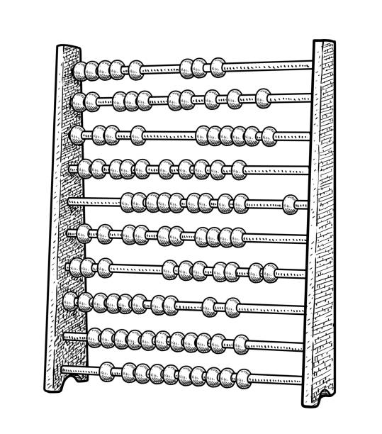

 <!-- section for 3 top images -->

 <!-- split each image into its own section for the grid rule to work -->
  
  

 <!-- split each image into its own section for the grid rule to work -->
  
  
  

 <!-- split each image into its own section for the grid rule to work -->
  
  
 

<h1 style="text-align: center; margin-top: 5px; margin-bottom: 16.5px;">Welcome to ATLAS!</h1> <!-- welcome text -->

<h4> The Abstract Thought and Language Across Space (ATLAS) databank is a compendium of published research on cross-cultural variability in the conceptualization of space, time, and number. Specifically, it collects published studies involving non-English-speaking participants that investigate: (1) spatial frames of reference, (2) spatial representations of time, and (3) spatial representations of number. </h4> <!-- databank description text -->

 <!-- map image -->

 <!-- gray footer section -->
  <h5>
  Our data and coding manual are now available for the Space domain while Time and Number are currently in the works! You can view and download them now on our [Open Science Framework](https://osf.io/83rj2/?view_only=ac995561401a43eda7e3394701b7bfcf). <!-- edit text in parenthesis to change OSF link -->
  </h5>

