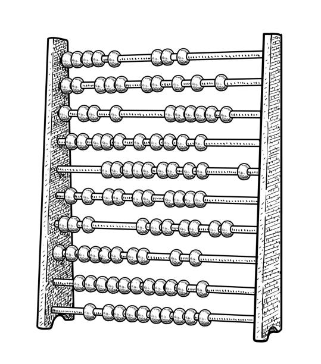
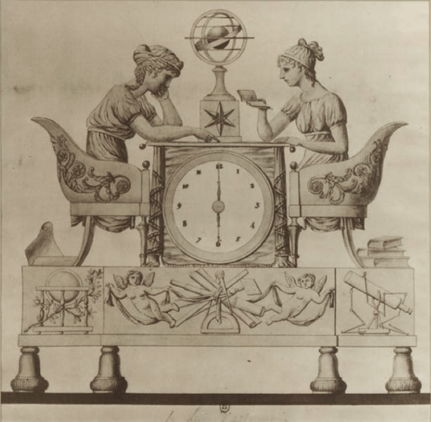
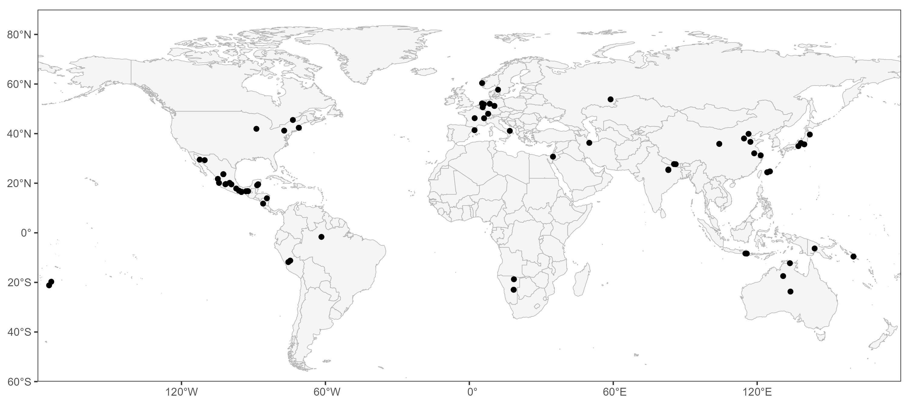

  
  

  
  
  

  
  
 

<h1 style="text-align: center; margin-top: 5px; margin-bottom: 16.5px;">Welcome to ATLAS!</h1>

<h4> The Abstract Thought and Language Across Space (ATLAS) databank is a compendium of published research on cross-cultural variability in the conceptualization of space, time, and number. Specifically, it collects published studies involving non-English-speaking participants that investigate: (1) spatial frames of reference, (2) spatial representations of time, and (3) spatial representations of number. </h4>

  <h5> 
  Our data and coding manual are  available for the Space domain while Time and Number are currently in the works! You can view and download them now on our Open Science Framework(https://osf.io/83rj2/?view_only=ac995561401a43eda7e3394701b7bfcf).
  </h5>

