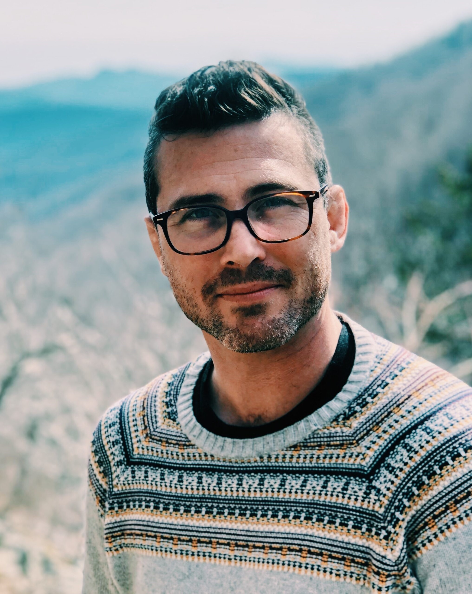
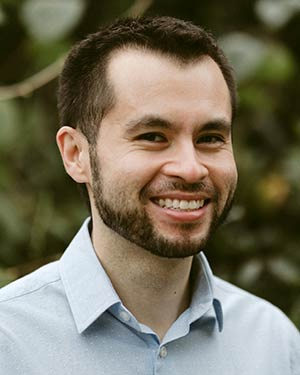

<h1 style="text-align: center;">Lead Investigators</h1>

  
  <h3>[Dr. Tyler Marghetis](https://www.tylermarghetis.com/)</h3>
  <h5> University of California, Merced </h5>
  <h5> tmarghetis@ucmerced.edu </h5>
  

  
  <h3>[Dr. Kevin Holmes](https://www.reed.edu/psychology/faculty/holmes.html)</h3>
  <h5> Reed College </h5>
  <h5> kjholmes@reed.edu </h5>
  
  

<h1 style="text-align: center;">Coding Coordinator</h1>

  
  <h3>[Alyssa Ortega](https://alyssavortega.github.io/)</h3>
  <h5> University of California, Merced </h5>
  <h5> aortega59@ucmerced.edu </h5>
  
 

 

<h1 style="text-align: center;">Coders</h1>

<h5>Maya Star-Lack</h5>
<h5>Benjamin Robbins</h5>
<h5>Ricardo Alfonso</h5>
<h5>Saloni Naik</h5>
<h5>Axel Jacobo</h5>
<h5>Kaushik Ram</h5>
<h5>Harini Muralidharan</h5>
<h5>Julia Ton</h5>
<h5>Leslie Flores</h5>
<h5>Isabella Dohnke</h5>
<h5>Sandra Chacon</h5>